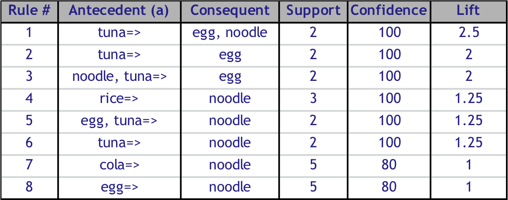
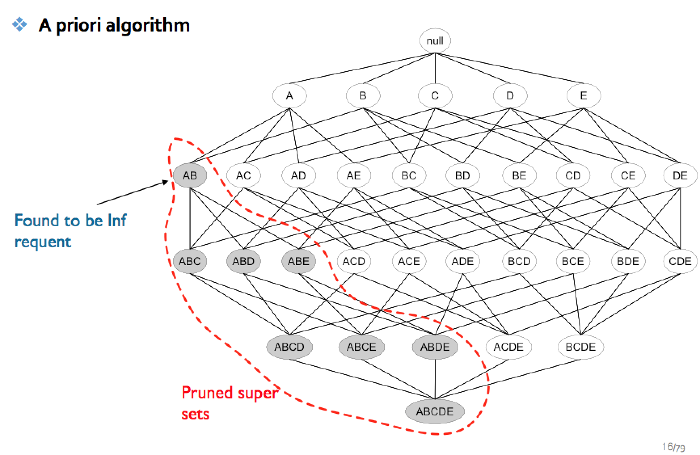

# 장바구니 분석 (Market basket analysis)

## TIP
- 효과적인 분석 하는 방법
특정 지지도, 신뢰도, 향상도 이상인 것 찾기  

- item 집합의 level
아이템을 어느 정도의 공통점으로 묶을 건지는 domain knoledge가 필요  
아래와 같이, 집합을 만드는 방법에 따라 규칙을 구성하는 item이 달라짐.  
ex) 음료 > 탄산 > 캔/통 > 500ml > 펩시  
만약, item 간의 level이 차이가 나면 모수가 달라지기 때문에 세세한 레벨의 item 관련 규칙이 적게 나올 수 있음  
ex) 우유, 500ml 펩시 캔 으로 나누면 level 차이가 많이 남

## 용어
- 조건절 (Antecedent) : IF part
- 결과절 (Conseqeunt) : THEN part

---

## 규칙
- item-based
각 레코드(영수증)의 거래 데이터는 user ID와 상관없이 독립된 데이터로 봄 = 구매 id 기준

- 조건절과 결과절은 상식적인 인과관계 고려 하지 않음
item 간에 구매 순서가 없기 때문에, 
실제 인과관계와 분석 결과는 차이가 있을 수 있음  
ex1) 애플 패드를 사는 사람은 펜슬도 산다 -> 펜슬을 사는 사람은 패드를 산다. 둘다 가능    
ex2) 아래 그림의 1번 룰은 **참치**를 사면, 라면/계란을 사는 걸로 나오는데, 실제로는 라면/계란 -> 참치를 사는 인과관계일 가능성이 높다  
단지, 라면/계란 -> 참치가 계산할 때 모집단이 커서 최소 신뢰도를 충족하지 못해서 안 나오는 것 뿐이다. 


- 신뢰도와 향상도를 같이 고려해야 하는 이유
상품이 거의 무조건 팔리는 기본재 (맥주집에서 맥주)인 경우,  
결과절에 해당 아이템이 들어오면 거의 100%의 신뢰도를 보여줄 수 있기 때문에  

- 조건절과 결과절은 각각 독립적인 아이템 집합을 가진다
즉, 같은 아이템이 조건절/ 결과절에 동시에 들어가지 않는다

- 규칙이 매우 많게 생성됨
계산이 너무 오래 걸리기 때문에, A priori algorithm을 이용하여 계산을 효과적으로 함

--- 

## 규칙의 효과성 측정 지표
- 지지도 Support
= 특정 아이템 포함 Data / 전체 Data  
frequent item set 판별하는데 사용  
즉, 특정 아이템을 포한하는 규칙의 발생 빈도수  
ex) 라면이 포함되어 있는 Data는 0.8 = 전체의 80 %
높을 수록 효과적인 규칙

- 신뢰도 Confidence
= 조건부 확률 == P(계란 | 라면) == P(라면, 계란)/ P(라면)  
특정 아이템 집단들의 연관성 강도  
즉, 실제 Data에서 특정 아이템 집단 A를 샀을때, 특정 아이템 집단 B를 산 정도  
ex) 라면, 계란을 산 사람은 즉석밥을 산 Data는 0.5 
높을 수록 효과적인 규칙

- 향상도 Lift
생성된 규칙이 실제 효용가치가 있는지 판별하는 지표  
= P(라면, 계란)/( P(라면)xP(계란) )  
= 실제 구매가 같이 발생할 확률/각 구매가 독립적으로 발생할 확률  
향상도가 1이라면, 실제 구매가 발생한 것이 독립적으로 발생한 것과 같다.  
즉, 인과관계가 없다  
최소 1 이상이여야 인과 관계가 있다고 본다  
3 ~ 5 정도 나오면 매우 잘 나오는 것. 5라는 것은 독립적으로 사는 경우보다 5배 많이 발생하고 있다는 뜻  
1 이하로 나오는 경우, 서로 반대의 기능을 하는 아이템을 살때  
ex) 설사약/ 지사제 같이 사지 않음

---

# 연관 규칙분석 (a priori algorithm) 
item-based 분석은 규칙이 너무 많이 생기기 때문에, 계산을 쉽게 만드는 기법  

## 규칙
- 자주 발생하는 집합만을 고려하자
최소지지도 값을 설정하여 지지도가 높은 규칙만 사용  
최소 지지도 값 이하인 규칙들은 계산도 하지 않음  
아래 그림처럼,  
최소 지지도를 만족하지 못하는 아이템 집합 AB가 포함된 집합은 계산 안함  


- 연관성이 높은 규칙만을 사용하자
최소 신뢰도 설정은 옵션  
왜냐하면, 조건절에 들어오는 P(A)가 크면 좋은 규칙이라도 신뢰도가 낮아짐.  

## 순차 연관 규칙 분석 sequentail association rule mining
단순 연관 규칙 분석은 시간관계, 구매 선후 관계를 고려하지 않음  
순차에서는 과거의 데이터가 조건절/ 미래가 결과절로 들어감

### 용어
- sequence
시간 관계를 고려한 data (transection?)

- subsequence
sequence를 포함하는 더 긴 sequence  
ex) AB -> E -> ACD 는 B -> A의 subsequence

### 분석 순서
기본적으로 분석 순서는 단순 연관 규칙 분석과 같으나, 데이터를 특정 순서에 따라 조건절/결과절로 나눈 것

- 최소 지지도를 만족하는 sequence 를 모두 나열 (일반 연관 규칙분석과 같이, 빈발 규칙을 먼저 찾는 것)
ex) A -> B, C -> F, A -> B -> C  

- 발생 가능한 모든 규칙에 대헤서 confidence를 계산하여, 최소 신뢰도 이상의 sequence에 대해서만 분석


--- 

# R 코드를 이용한 실습
```{r}
library(arules)
library(arulesSequences)
library(arulesViz)
library(wordcloud)

path <- "/Users/earllee1/googledrive/github/til/data_science/Basic_Course_1/빅데이터 Basic과정_교안 공유/3일차 - 연관규칙분석 및 군집화 (강필성)/"

# 데이터를 연관 규칙 분석을 하기위해 트랜젝션 형태로 불러옴
## 데이터 불러오는 예시 Basket type
tmp_basket <- read.transactions(paste0(path,"Transaction_Sample_Basket.csv"), 
                                format = "basket", sep = ",", rm.duplicates=TRUE)
inspect(tmp_basket)

## 데이터 불러오는 예시 Single type
tmp_single <- read.transactions(paste0(path,"Transaction_Sample_Single.csv"), 
                                format = "single", cols = c(1,2), rm.duplicates=TRUE)
inspect(tmp_single)

## 패키지의 샘플 데이터 확인
data("Groceries")
summary(Groceries)
str(Groceries)
itemInfo(Groceries)

# 데이터를 data.frame 형식으로 변경. 이건 왜 했지?
groceries_df <- as(Groceries, "data.frame")

# 아이템 정보 분류
itemName <- itemLabels(Groceries)
itemCount <- itemFrequency(Groceries)*9835

# 워드 클라우드 만들어봄
col <- brewer.pal(8, "Dark2")
wordcloud(words = itemName, freq = itemCount, min.freq = 1, scale = c(3, 0.2), col = col , random.order = FALSE)

# 히스토그램 생성
itemFrequencyPlot(Groceries, support = 0.05, cex.names=0.8)

# Rule generation by Apriori (연관 규칙 분석의 규칙 생성)
rules <- apriori(Groceries, parameter=list(support=0.01, confidence=0.35))

# Check the generated rules
inspect(rules)

# lift 기준 내림차순해서 확인
inspect(sort(rules, by="lift"))

# Save the rules in a text file
#write.csv(as(rules, "data.frame"), "Groceries_rules.csv", row.names = FALSE)

# Plot the rules
plot(rules, method = "scatterplot")
plotly_arules(rules, method = "scatterplot", measure = c("support", "confidence"), shading = "lift")

plot(rules, method="matrix")
plotly_arules(rules, method = "matrix", measure = c("support", "confidence"), shading = "lift")

# Rule generation by Apriori with another parameters
rules <- apriori(Groceries, parameter=list(support=0.01, confidence=0.5))

# 교수님이 가장 선호하는 그림이라 함
# 크기는 지지도, 색상의 진한 정도는 향상도, 신뢰도는 빠져 있음. 
# 원으로 들어오는 화살표는 조건절/ 나가는 화살표는 결과절을 의미함 
plot(rules, method="graph") 

#
plot(rules, method="paracoord")
              
# Part 3: Association Rule Mining with sequence information
# MS에서 연습용으로 준 데이터
foodmart_tr <- read_baskets(paste0(path,"foodmart_transactions2.txt"),  info = c("sequenceID","eventID","SIZE"))
foodmart_df <- as(foodmart_tr, "data.frame")

# Find frequent sequences
start.time <- proc.time()

# 연관 규칙분석 알고리즘 실행
## cspade 함수 = 자주 발생하는 sequence 찾음 (순서가 존재함)
### maxsize = 한 집합에 들어가는 아이템 개수를 정함. 계산 효율성을 위해 정확도를 조금 포기함. 아마 case가 별로 없을 것이다.
### maxlen = sequence의 -> 개수, A -> B -> C -> D -> E 의 경우는 5, 이것도 위와 마찬가지로 효율성 위해..
seq_rules <- cspade(foodmart_tr, parameter = list(support = 0.0005, maxsize = 10, maxlen = 5),
                    control = list(verbose = TRUE))
proc.time() - start.time

summary(seq_rules)

### Filter frequent sequences with the length greater than 2
### 자주 발생하는 sequence들을 data frame 형태로 만듦
seq_rules_df <- as(seq_rules, "data.frame")
seq_rules_df[1:5,]

### sequence에 들어있는 element 개수
seq_rules_size <- size(seq_rules)

### 
seq_rules_df <- cbind(seq_rules_df, seq_rules_size)

### 규칙을 찾아야 하니까 subsequence가 1개인 것은 의미가 없음. 최소 2개가 되야 한다
### sequence 데이터의 {} 맨 앞에 부터 ,를 기준으로 순차적으로 발생했다고 보면 됨
seq_rules_df_filtered <- subset(seq_rules_df, seq_rules_df$seq_rules_size > 2)
seq_rules_df_filtered[1:5,]

#write.csv(seq_rules_df_filtered, file = "seq_rules_filterd.csv", row.names = FALSE)

# Find association rules
## ruleIn.. 이 규칙을 찾아주는 함수
seq_rules_induced <- ruleInduction(seq_rules, confidence = 0.2)
summary(seq_rules_induced)                    
inspect(seq_rules_induced)

# Save the results
seq_rules_induced_df <- as(seq_rules_induced, "data.frame")
#write.csv(seq_rules_induced_df, file = "seq_rules_induced_df.csv", row.names = FALSE)


```


