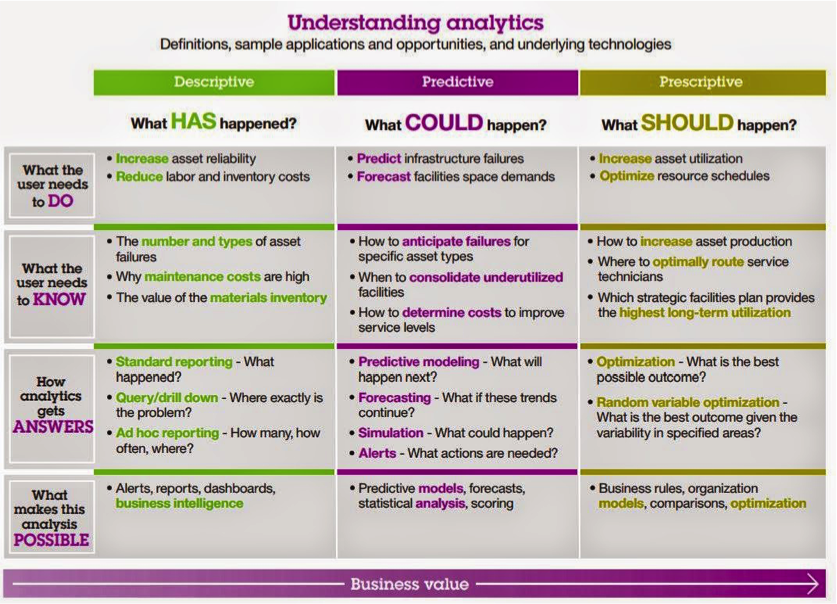
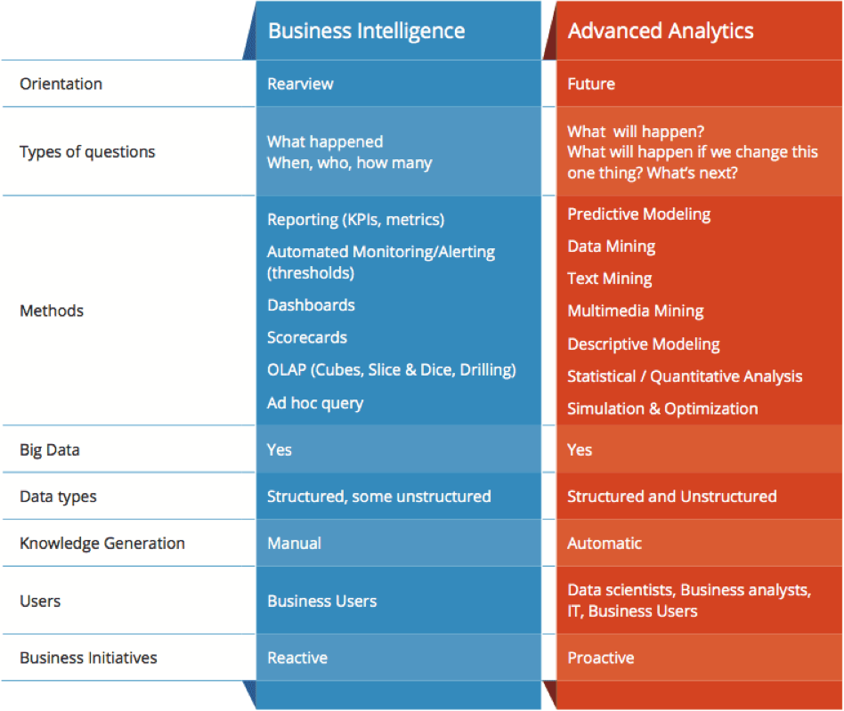
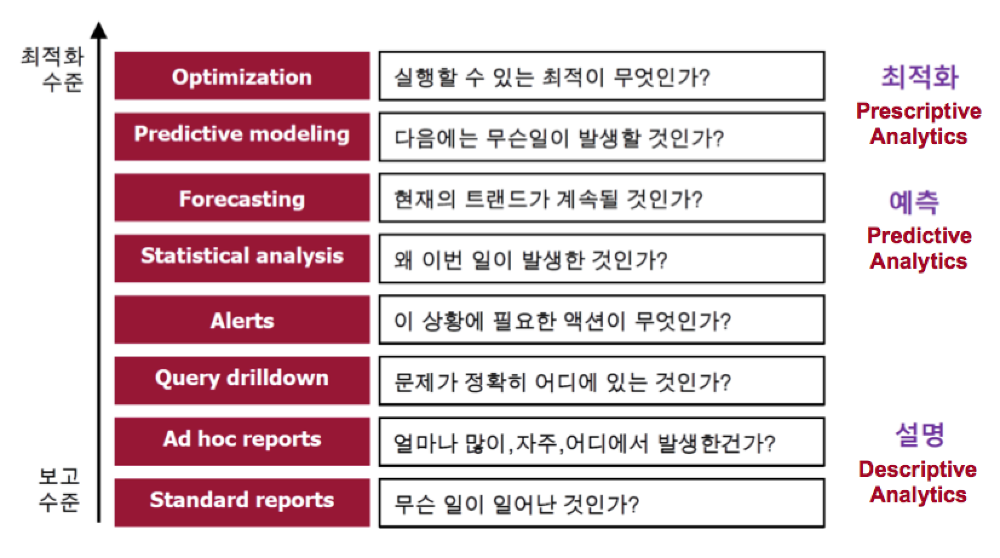

# 데이터 사이언스 실력 평가 과정
데이터 사이언스 실력을 늘리는 과정이라고 보면 될 듯 하다

## Descriptive analysis
통계적 기법을 사용하여 데이터의 특징을 묘사  
과거와 현재의 데이터  
Summarize (집계) 방식 사용

## Predictive analysis 
미래 예측 용도  
머신러닝 알고리즘 사용   

## Prescriptive analysis 
최적화 이론  
Optimization 테크닉 사용  

# 의사결정 과정

# 데이터 분석 process
7 8 page 적용

## 데이터 모집

## 데이터 선택

## 전처리

## 데이터 마이닝

## 머신러닝

## 후처리?

## 최적화 (optimization)

