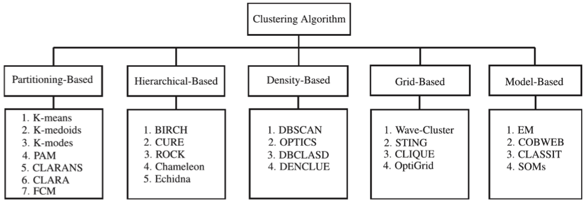
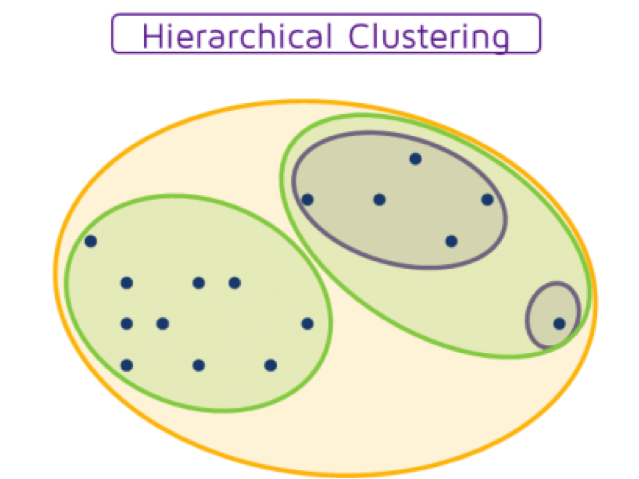
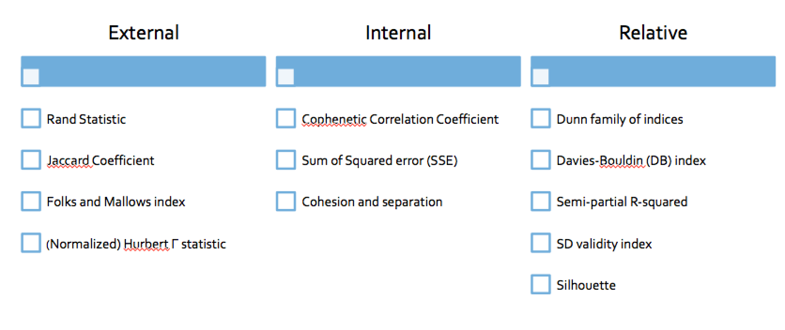
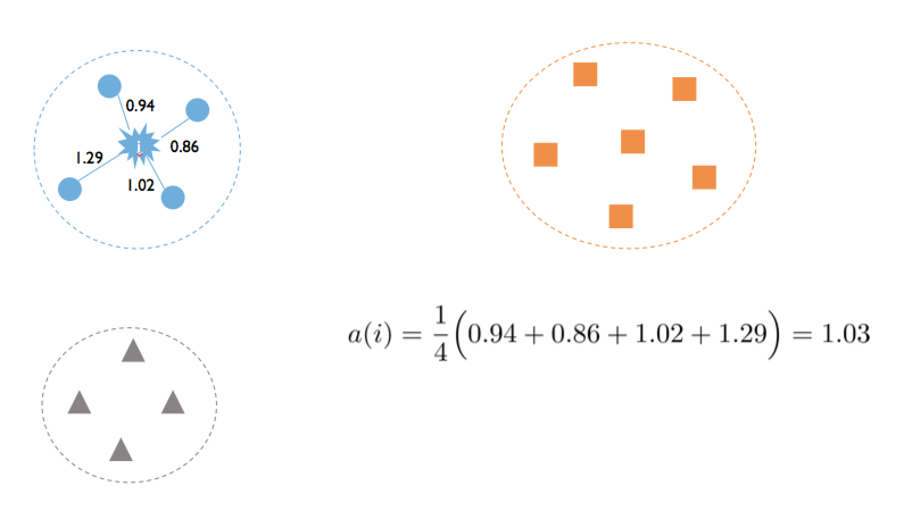
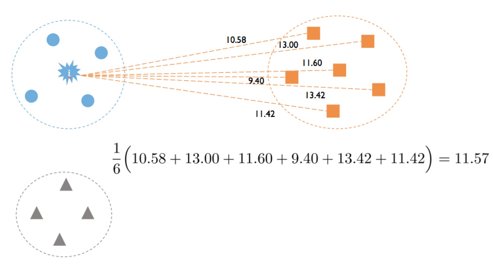
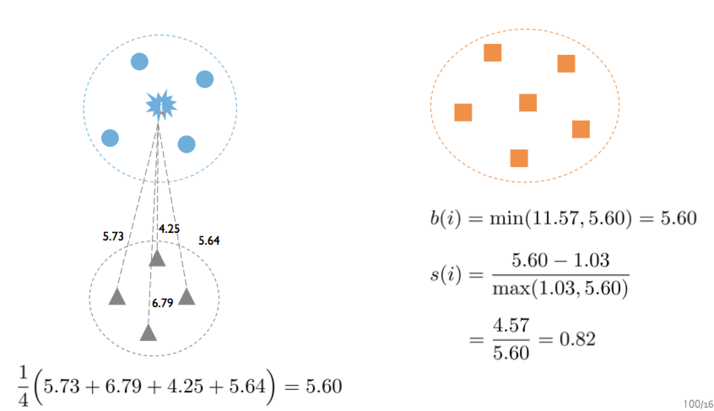

# 질문 거리들
- 왜 패키지들은 신뢰도를 계산할 때, 아이템이 조건절/결과절에 같은 item이 들어갈 수 있게 했는가?
- 연관규칙분석에서 최소 신뢰도 값을 설정함으로써 좋은 규칙이라고 명명할 수 있는 규칙을 놓칠 수 있는가? 
- 군집화 방법은 거리 기반 밖에 없는가?
- 명목형 변수에 대해 군집화 할 수 있는 방법은?
- 논문 처럼 미리 정답을 정해 놓고 (내가 원하는 결과), 그걸 test set으로 사용해서 튜닝을 하면 언될까?
- EM 알고리즘은 2개의 변수일때만 가능한가?

---

# 목적
- 비슷한 유저들끼리 묶기

# 기본 개념
- 같은 집단 사람들끼리는 거리가 가깝게
- 다른 집단끼리는 거리가 멀게

---

# 분류와 군집화 비교
- 분류
지도 학습, 어느 범주에 들어갈지 판단/ 예측

- 군집화
비지도 학습, 기존 데이터를 이용해서 최적의 구분

---

# 군집화 종류
## Hard clustering == crisp clustering
- 한 객체는 여러 군집에 속하면 안됨
- 서로 곂치지 않는 (non-overlapping) 군집

## soft clustering (Fuzzy clustering)
- 한 객체는 여러 군집에 속할 확률을 가짐
- 좀 더 어려움

---

# 관련 알고리즘 종류
## 분류형 군집화
- 한번에 모든 객체가 움직이기 때문에 속도가 빠름
- [k-means](k_means_clustering.nb.html)

## 계층적 군집화
- 한번에 한개 몪기 때문에 계산 속도가 느림
- [계층적 (Hierarchical)](hierarchical_clustering.nb.html)

## SOM (자기조직화 지도)
- 2차원에 나타낼 수 있다는 장점이 있음
- 좀 불안정하여 잘 안 쓰임
- 수학적 계산이 많이 필요

## 밀도 기반 군집화
- DBSCAN (대표적인 알고리즘)
- 배우지는 않지만, 앞의 군집화가 잘 먹힐 때 고려해볼 것

---

# 분석을 수행 할 때 고려할 점
- 어떤 변수를 사용? 
전처리 

- 군집화 결과를 어떻게 평가할 것인가?
지도학습을 통한 예측은 시간이 지나면 확인할 수 있고, validation set으로도 확인 가능  
하지만 비지도학습은 결과를 평가하기 어려움.  
결과들의 비교들 통해 누가 제일 잘 구분된 것인지 정도는 알 수 있음

- 어떻게 결과를 보여줄 것인가?
결과 시각화

---

# 평가 타당성 지표
## External 
외부 정답 레이블과 비교  
Train/ test/ validation 같이.. 하지만 논문 쓸 때만 사용 가능
이미 확실하게 나뉘어 있는 상황에서

## internal
군집이 얼마나 컴팩트 한가?

## Relative
군집이 얼마나 컴백트 하면서, 다른 군집과 얼마나 멀리 있나?

## 타당성 지표 계산 방법
### Dunn Index
- 각 군집에 속한 점 간의 거리 중에 가장 짧은 것
- 하나의 군집에 속한 점 간의 거리 중에 가장 긴 것
- 계산 방식
I(C) = min(군집내 거리)/ max(군집간 거리)
- 클 수록 좋은 군집화
- 여러 결과를 비교하여 상대적 우열 확인

### Silhouette
- a(i) : 같은 군집 내에서 개체(i)와 다른 개체와의 거리 평균
- b(i) : 개체(i)와 다른 군집의 개체들과의 거리 평균 중에 가장 작은 값 (가장 가까운 군집과의 거리 평균)
- s(i) = (b(i) - a(i))/max(a(i), b(i))
- s(i) <= 1, a(i) == 0 일때, 한 군집이 한 점에 뭉쳐 있을 때
- s(i) >= 1, b(i) == 0 일때, 서로 다른 군집이 한 점에 뭉쳐 있을 때
- S = 1/n x sum(s(i)) 로 군집화를 평가함.
즉, 모든 객체에 대해 계산함  
크면 클수록 좋다

---

