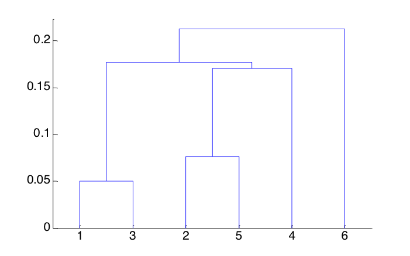
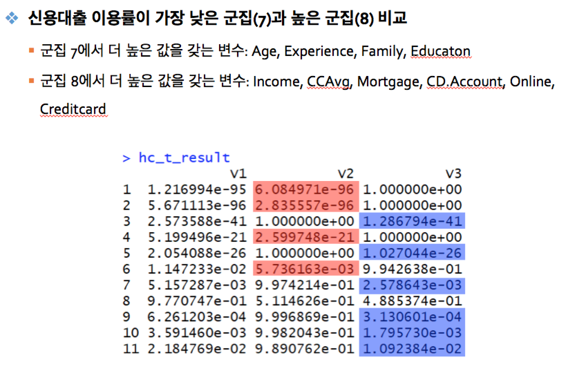
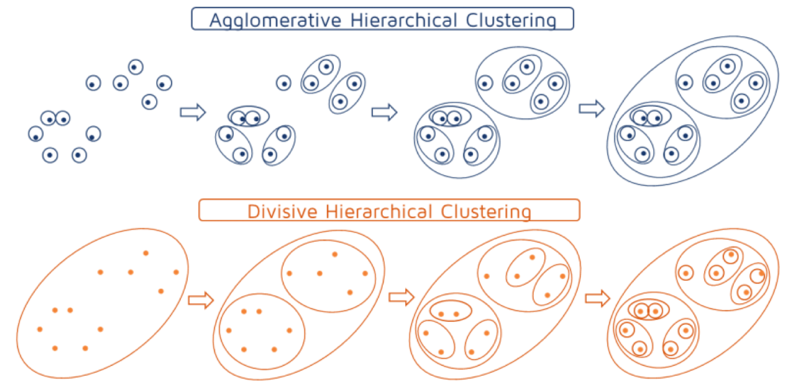
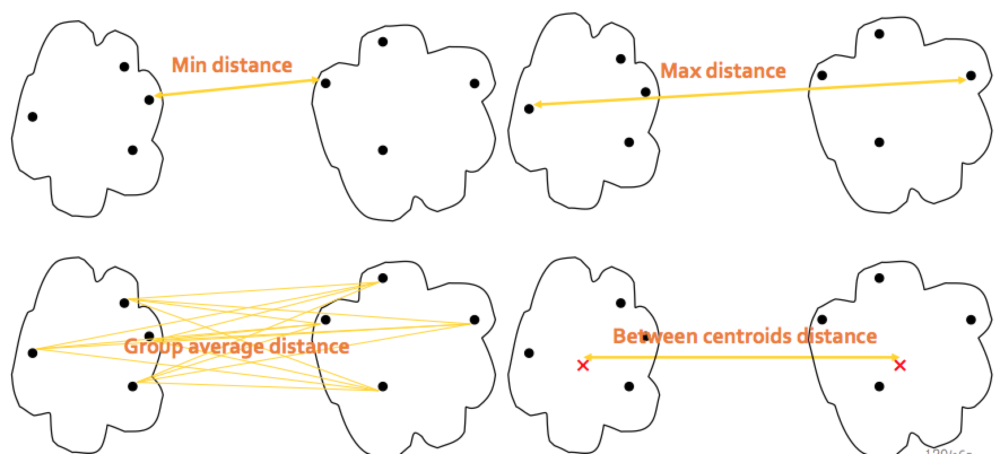
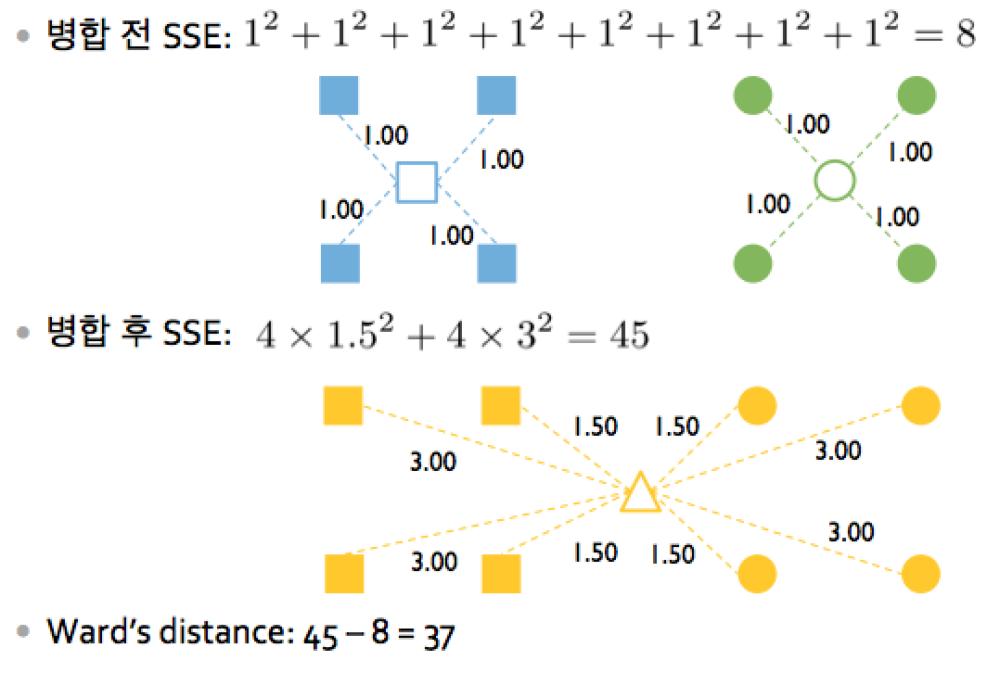

# 속성
- 가장 가까운 애들끼리 먼저 묶어주기 시작함
- 특정 분야에서는 계통체계를 표현하게 되기도 함
- 객체간 거리 행렬/ 유사도 행렬을 input으로 사용 (메모리 많이 먹음)
- 덴드로그램(Dentrogram)으로 시각화 가능



# Tip 
- 아래 그림처럼 각 군집에서 각 변수의 값을 가지고, 종속변수인 LoanRatio를 설명할 수 있다


# 장점
- 군집의 개수에 따라 변화하지 않으므로, 계산을 다시 할 필요가 없음

# 단점
- 모든 객체의 계산 후, 그룹핑을 한번 하기 때문에 계산 속도가 느림

# Big-O 계산
- N개의 군집에 대해 군집화하려면, N-1번의 계산이 필요함


# 방식



## 상향식 군집화 Agglomerative
전체 객체끼리 가까운 애들끼리 묶기 시작

### 알고리즘


#### single linkage
- 각 군집에 속한 개체중 가장 작은 거리끼리 묶음
- 원이 아닌 군집도 찾을 수 있음

#### complete linkage

#### Group Average distance
- k-means와 비슷한 결과가 나올 수 있음

#### between centroids distance 
- k-means와 비슷한 결과가 나올 수 있음

#### wards' method
- 단순히 거리 정보가 아니라 분산을 고려
- 두 집합을 합칠 때 사용
- 집합이 합쳐짐으로써, 군집 내 객체 사이의 분산이 증가한 정도를 확인하여, 증가량이 적은 집합끼리 먼저 합칩



## 하향식 군집화 divisive
- 전체를 하나의 군집으로 보고 시작
- 하나의 군집을 n개로 나누는 것을 반복

# R 실습
```{r}
library(clValid) # 군집화 타당성 평가 관련된 패키기
library(plotrix) # 군집화 시각화로 각 군집화끼리 비교

path <- "/Users/earllee1/googledrive/github/til/data_science/Basic_Course_1/빅데이터 Basic과정_교안 공유/3일차 - 연관규칙분석 및 군집화 (강필성)/"


# Part 2: Hierarchical Clustering -----------------------------------------
# 지도학습용 샘플 데이터이기 때문에, 답이 존재해서, 삭제함
# 독일의 개인 정보에 따른 신용 대출 이용 여부 예측 데이터
ploan <- read.csv(paste0(path,"Personal Loan.csv"))
ploan_x <- ploan[,-c(1,5,10)] # 필요없는 변수 + 종속 변수 삭제
ploan_x_scaled <- scale(ploan_x, center = TRUE, scale = TRUE)

# Compute the similarity using the spearman coefficient
# 거리 행렬을 만드는데, 유클리드 방식이 아닌 cos 유사도 방식을 사용
cor_Mat <- cor(t(ploan_x_scaled), method = "spearman") # 객체간 cos 유사도? 각도?
dist_ploan <- as.dist(1-cor_Mat) # 거리 * (1- cos 각도) 를 이용해서 거리를 구함. cos 각도는 작을 수록 좋으므로, 거리의 개념과 반대여서 (1-cos)를 곱함

# Perform hierarchical clustering
# maximum distance 방식 사용
hr <- hclust(dist_ploan, method = "complete", members=NULL)

# plot the results
# dentrogram 그려봄
plot(hr)
plot(hr, hang = -1)
plot(as.dendrogram(hr), edgePar=list(col=3, lwd=4), horiz=T)

# Find the clusters
# K (최적 군집의 개수)를 찾는 부분은 시간상 생략했음
mycl <- cutree(hr, k=10) # cutree는 뭐지?
mycl

plot(hr)
rect.hclust(hr, k=10, border="red")


# Compare each cluster for HC
# 각 feature들이 각 군집에서 어느 정도 값을 가지는지 확인
# 변수 중 LoanRatio가 종속변수인, 신용 대출 받는 정도
ploan_hc <- data.frame(ploan_x_scaled, ploanYN = ploan[,10], 
                         clusterID = as.factor(mycl))
hc_summary <- data.frame()

for (i in 1:(ncol(ploan_hc)-1)){
  hc_summary = rbind(hc_summary, 
                     tapply(ploan_hc[,i], ploan_hc$clusterID, mean))
}

colnames(hc_summary) <- paste("cluster", c(1:10))
rownames(hc_summary) <- c(colnames(ploan_x), "LoanRatio")
hc_summary

# Radar chart
par(mfrow = c(2,5))
for (i in 1:10){
  plot_title <- paste("Radar Chart for Cluster", i, sep=" ")
  radial.plot(hc_summary[,i], labels = rownames(hc_summary), 
              radial.lim=c(-2,2), rp.type = "p", main = plot_title, 
              line.col = "red", lwd = 3, show.grid.labels=1)
}
dev.off()

# Compare the cluster 7 & 8
hc_cluster7 <- ploan_hc[ploan_hc$clusterID == 7, c(1:11)]
hc_cluster8 <- ploan_hc[ploan_hc$clusterID == 8, c(1:11)]

# t_test_result
hc_t_result <- data.frame()

for (i in 1:11){
  
  hc_t_result[i,1] <- t.test(hc_cluster7[,i], hc_cluster8[,i], 
                              alternative = "two.sided")$p.value
  
  hc_t_result[i,2] <- t.test(hc_cluster7[,i], hc_cluster8[,i], 
                              alternative = "greater")$p.value
  
  hc_t_result[i,3] <- t.test(hc_cluster7[,i], hc_cluster8[,i], 
                              alternative = "less")$p.value
}

hc_t_result


```


