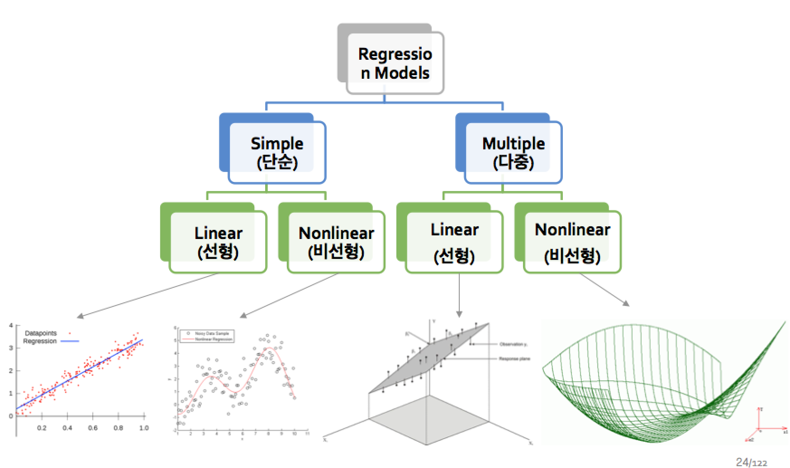

회귀분석은 기본적으로 연속형 변수에 대해 특화된 모델이다 (범주형이 많으면 설명력이 낮다)
의사결정 나무가 범주형 변수에 특화된 모델  
변수의 증가의 영향력으로 Y를 설명할 수 있으므로, 설명력이 좋다고 할 수 있음

# 정의
## 선형회귀 
종속 변수와 입력 변수 사이의 관계를 직선으로 표현

## 선형식
X 기준 1차 방정식

## E(Y) 와 Y^ 표현의 차이
E(Y) = 방정식 상태  
Y^ = 최적해를 예측한 상태  

## 베타0 
Bias라고 생각하면 됨

---

# 단점
- R^2 는 새로운 X를 추가하면 무조건 올라간다. 유의하지 않은 변수를 넣어도 조금은 올라감
- 위 단점을 해결하기 위해 Adjusted R^2 (수정결정계수) 도입

---

# TIP
- 분석은 구하려는 함수식의 모르는 변수의 최적값을 찾아내면, 함수를 알 수 있다는 개념 
- Y값 변동이 거의 없는 데이터는 회귀분석을 안 쓰고 그냥 평균 내는게 나을 수 있음
- 명목형 변수는 case에 따라 boolen 변수들로 나눠줄 수 있음 
그냥 1,2,3 으로 놓는 것은 양적 증가에 대한 영향력이 있는 것처럼 계산됨.  
따라서, 각 case에 0/1로 나누어 놓으면 1 증가에 대한 영향력을 계산 할 수 있음  
단, 범주가 2~3개 정도면 괜찮은데/ 많아지만 회귀를 쓰기 애매해짐
- train/ test는 보통 6:4 혹은 7:3으로 하는 경우가 많음
- P-value가 0.05보다 작으면 믿을 수 있다고 생각이 됨 (작을 수록 좋음)
<!-- -->

---

# 구분
## x변수의 수와 추정되는 함수의 형태에 따라

---

# 단어
## 확률 오차 (random error)
- 엡실론
- Y 와 Y^의 차이
- 에러는 평균이 0, 분산이 시그마^2 를 따르게 만들어야 정확한 모델을 만들 수 있음
- 위 가정에 따라, 에러는 평균을 취하면 사라진다. E(엡신론) = 0
- e (residual, 자차)라고도 부름

## SSE
- 잔차의 제곱을 다 더함

## SSR
- x의 효과를 제곱해서 더함

## SST
- Total = SSR + SSE
<!-- ? -->

## Coef (계수)

## corilation?
- C
- R^2의 제곱근 관계를 가짐

## 차원 축소
중요한 변수만 뽑아 쓰겠다 == feature selection == 중요 인자 찾기  

## thrashhold?

---

# R 스퀘어 == R^2
- 회귀분석에서 X 변수의 도움이 되는 정도를 확인하는 방법 == 
- R^2 = SSR/SST
- 0 <= R^2 <= 1
- SSR/SST == 0이라면, 그냥 Y를 평균 낸 것과 같다. X의 값들이 별 도움이 안 되었음
- SSR/SST == 1이라면, X == Y로 X를 넣어 만든 모델이 Y와 100% 설명한다. 
- SSR/SST == 0.1이라면, 그냥 **Y값으로 평균 낸 것보다** 10% 효과를 봤다고 생각하면 됨
- 협업에서는 0.7 이상이 되기 힘들다
<!-- --> 

## 적합도 올리기
- R^2 를 높히기 위해, X를 변경하던지/ 새로운 X 변수를 추가하던지

# 성능 평가
보통 아래의 것들을 다 해봐서 비교해야 한다  
각 변수가 같이 좋거나 같이 나쁜 경우가 많음

1. test set으로 확인

2. 평균 절대 오차 (MAE)
실제 값과 예측 값 사이의 절대적인 오차의 평균 이용  
전반적인 performance 볼때  
MAE가 좋다 == 전체적으로 좋음

3. 상대적인 평균 절대 오차 (MAPE)
%로 나타내기 위해 실제값으로 나눔

4. 부호의 영향을 제거하기 위해 절대값 대신 제곱을 취한 지표(R)MSE
정확하게 볼려할때  
MSE가 좋다 == 큰 오류 없이, 확 튀는 데이터가 없음

---
# 계산 방식
- 실측치와 직선과의 차이를 최소화

---
# 수정 결정계수 (Adjusted R^2)
- 기존 R^2 식에 뭔가 곱해줌으로써, 유의하지 않은 변수를 추가해도 R^2가 증가 안하게 만듬
- SSE가 어느 정도 이상이 아니라면 증가가 안 일어나도록 막음

# 선형 회귀분석 porcess
- 엡실론을 최소화 시키는 베타0, 베타1... 을 찾는다
- 각각에 대해 미분을 하여 0이 되는 점을 찾는다
- 연립방정식으로 찾으려고 하는 각 변수를 찾는다

# feature selection 방법
여기서 성능 향상은 F-test 방법으로 보통 확인함  
변수간의 교우 작용? 을 가지고 선택하는 방식

## 전진 선택법
- 변수 1개를 가지고 모델링
- 다른 변수들을 하나씩 넣어보고, 가장 성능 향상이 높은 변수를 채택
- 성능 향상이 거의 없을때까지 반복

## 후진 소거법
- 변수 전체를 가지고 모델링
- 변수들을 하나씩 빼면서, 성능 향상이 있는 변수를 삭제함
- 성능 향상이 거의 없을때까지 반복

## 단계적 선택법
- 전진과 후진을 반복
- 시간이 오래 걸림
- 변수 1개를 가지고 모델링
- 전진 선택법과 후진 소거법을 한번씩 실행
- 성능 향상이 거의 없을때까지 반복

